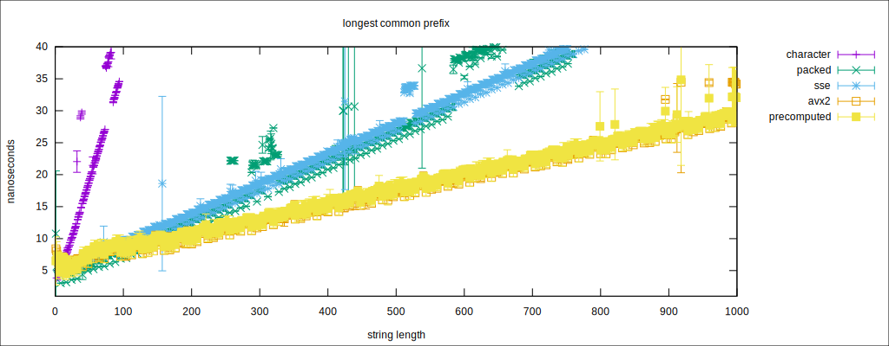

Packed String Library
=====================

This library consists of the following C++17 header files:

- `character.hpp` for working with 64-bit packed characters. An example is given in the source file `example_character.cpp`.
- `lcp.hpp` for answering longest common prefix queries.

## Longest Common Prefix Query

Depending on the string length, a longest common prefix (lcp) function is chosen that is geared towards
this string length. 
We use the technique of word packing for comparision.
This is either done by using the machine word size (64-bits), or vectorizing techniques of the SSE and AVX instruction sets.

The following graph shows an evalution made with naive character comparison (`character`) and word-packing in machine word size (`packed`),
or with the instruction sets `SSE2` and `AVX2`.

The evaluation was conducted on an Intel Core i7-8550U CPU.

An evaluation of all available lcp generates a new file `lcp_gen.cpp` providing a function `longest_common_prefix`, which
selects the best function with respect to the string length.

### Why

Longest common prefix queries are fundamental, having several applications like

- computing the LCP array, or
- computing the longest common extensions like `lcp(T[i..],T[j..])`, for which LCE data structures have been developed. 
  However, these data structures are only useful if the length is expected to be long (> 2000 characters). 
  Current CPU architectures featuring long cache lines and word sizes make character comparision by word packing a fast alternative to LCE data structures.

## Dependencies

- Command line tools
  - cmake
  - make
  - a C++17 compiler like gcc or clang 
  - gtest (optional) for tests
  - celero (optional) for benchmarking

## Installation

This package ships as a library with a test program.
Invoke `cmake` and `make` to compile, `make test` to test the compilation, and `make install` to install the library and the header files.

## License

The framework is published under the
[Apache License 2.0](https://www.apache.org/licenses/LICENSE-2.0)

